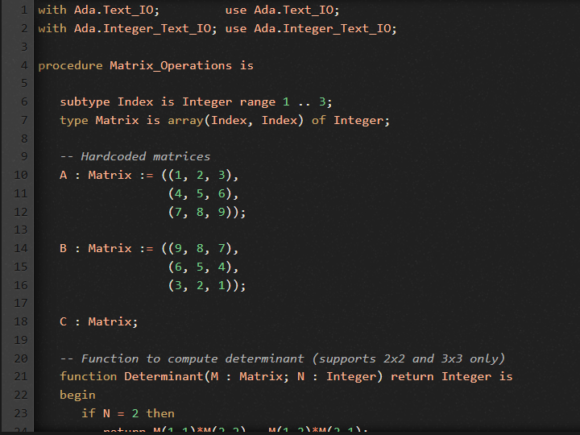
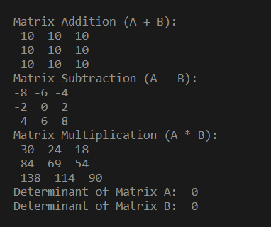

# Ada Matrix Operations

This project demonstrates **matrix operations** in **Ada**. The program performs addition, subtraction, multiplication, and calculates the determinant of 3x3 matrices. Matrices are hardcoded in the program, so it runs immediately without requiring user input.

---

## Features

- Matrix addition (A + B)
- Matrix subtraction (A - B)
- Matrix multiplication (A * B)
- Determinant calculation for 3x3 matrices
- Fully hardcoded input matrices for immediate execution

---

## Example Output

```
Matrix Addition (A + B):
10 10 10
10 10 10
10 10 10

Matrix Subtraction (A - B):
-8 -6 -4
-2 0 2
4 6 8

Matrix Multiplication (A * B):
30 24 18
84 69 54
138 114 90

Determinant of Matrix A: 0
Determinant of Matrix B: 0
```

---

## Getting Started

### Prerequisites

- **Ada compiler** (GCC with GNAT, or online compilers like JDoodle).  
- **Online IDEs / Compilers**:
  - [JDoodle – Ada](https://www.jdoodle.com/execute-ada-online/)
  - [Rextester – Ada](https://rextester.com/l/ada_online_compiler)
  - [Ideone – Ada](https://ideone.com/)

### Running the Program

1. Save the code in a file with `.adb` extension, e.g., `Matrix_Operations.adb`.  
2. Compile and run the program using your Ada compiler or paste it in an online IDE.  
3. Output will display matrix operations results automatically.

---

## Ada Code Snippet (Hardcoded Matrices)

```ada
with Ada.Text_IO;         use Ada.Text_IO;
with Ada.Integer_Text_IO; use Ada.Integer_Text_IO;

procedure Matrix_Operations is

   subtype Index is Integer range 1 .. 3;
   type Matrix is array(Index, Index) of Integer;

   A : Matrix := ((1, 2, 3),
                  (4, 5, 6),
                  (7, 8, 9));

   B : Matrix := ((9, 8, 7),
                  (6, 5, 4),
                  (3, 2, 1));

   C : Matrix;

   function Determinant(M : Matrix; N : Integer) return Integer is
   begin
      if N = 2 then
         return M(1,1)*M(2,2) - M(1,2)*M(2,1);
      elsif N = 3 then
         return M(1,1)*(M(2,2)*M(3,3)-M(2,3)*M(3,2)) -
                M(1,2)*(M(2,1)*M(3,3)-M(2,3)*M(3,1)) +
                M(1,3)*(M(2,1)*M(3,2)-M(2,2)*M(3,1));
      else
         return 0;
      end if;
   end Determinant;

begin
   -- Addition
   Put_Line("Matrix Addition (A + B):");
   for I in Index loop
      for J in Index loop
         C(I,J) := A(I,J) + B(I,J);
         Put(C(I,J)'Img & " ");
      end loop;
      New_Line;
   end loop;

   -- Subtraction
   Put_Line("Matrix Subtraction (A - B):");
   for I in Index loop
      for J in Index loop
         C(I,J) := A(I,J) - B(I,J);
         Put(C(I,J)'Img & " ");
      end loop;
      New_Line;
   end loop;

   -- Multiplication
   Put_Line("Matrix Multiplication (A * B):");
   for I in Index loop
      for J in Index loop
         C(I,J) := 0;
         for K in Index loop
            C(I,J) := C(I,J) + A(I,K)*B(K,J);
         end loop;
         Put(C(I,J)'Img & " ");
      end loop;
      New_Line;
   end loop;

   -- Determinants
   Put_Line("Determinant of Matrix A: " & Determinant(A, 3)'Img);
   Put_Line("Determinant of Matrix B: " & Determinant(B, 3)'Img);

end Matrix_Operations;
```

---

## File Extension

- Use `.adb` for Ada source files (program body).  

---

## License

This project is for **educational purposes**. You may freely use, modify, and share the code.

---

## References

- [Ada Programming Language – GNAT](https://www.adacore.com/gnatpro)
- [JDoodle – Ada Online Compiler](https://www.jdoodle.com/execute-ada-online/)
- [Rextester – Ada Online Compiler](https://rextester.com/l/ada_online_compiler)

## Screenshot



